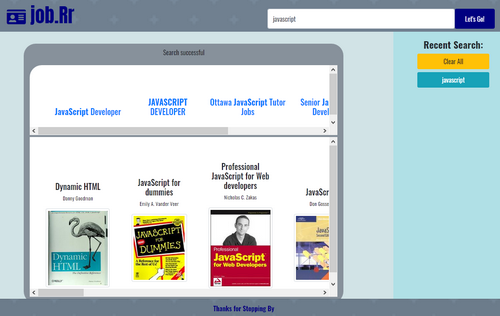

# job.Rr
The purpose of this project was to create a functional website using our knowledge pertaining to the criteria that has been taught thus far in the program. For this project, we as a group decided to fabricate a website that would search job listings as well as recommended readings. We used two APIs to get the job and book information; Adzuna for the job listings and the Open Library API for the books. JQuery's `.ajax()` function was used to fetch data from the APIs.

```
$.ajax({
    url: queryURL,
    method: "GET"
  }).then(function (result){
    $("#job-options").text("");
    for(i=0; i<result.results.length; i++){
      //Job title
      let jobTitle = result.results[i].title;
      //Job posting
      let jobLink = result.results[i].redirect_url;
      $("#job-options").append(
        `<div id="job-options">
          <h5 class="jobTitle text-wrap">${jobTitle}</h5>
          <a href="${jobLink}" target="_blank" class="card-text text-wrap">Link to Posting</a>
        </div>`
      )
    }
  })
 ``` 
The screenshot below shows the job listings and book recommendations as a result of searching for 'Javascript'. 

The sidebar on the right-hand side of the webpage contains recent searches which are saved via local storage, and thus, will be presistent even following the refresh of the page. In order for the search to be cleared from the local storage a clear function is implemented into the JS file. 

## Technologies Used
* HTML
* CSS
* Bootstrap
* fontawesome 
* Javascript
* jQuery 
* Adzuna Job Search API 
* Open Library API
* localStorage

## Work Breakdown
* **Victor Sherman** worked on the Adzuna Job API. 
* **Cecil King** worked on Open Library API.
* **Brooklyn Minor** worked on localStorage and getting the recent searches to appear as well as error messaging for invalid searches. 
* **Leah O’Gorman** worked on the HTML, CSS, and Bootstrap.

## Try It
You can view the project [here](https://vicscherman.github.io/project1/).  
